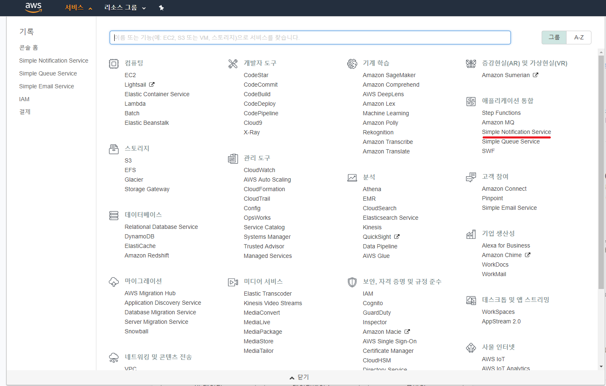
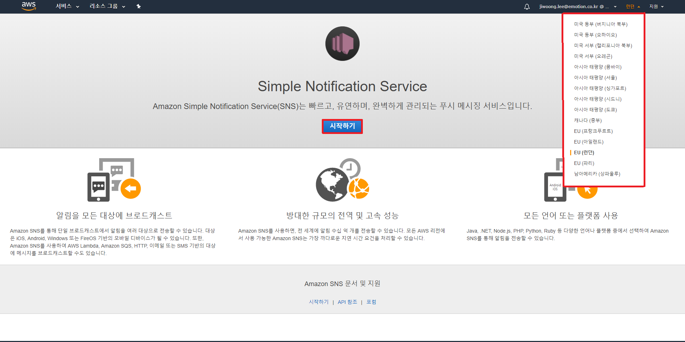
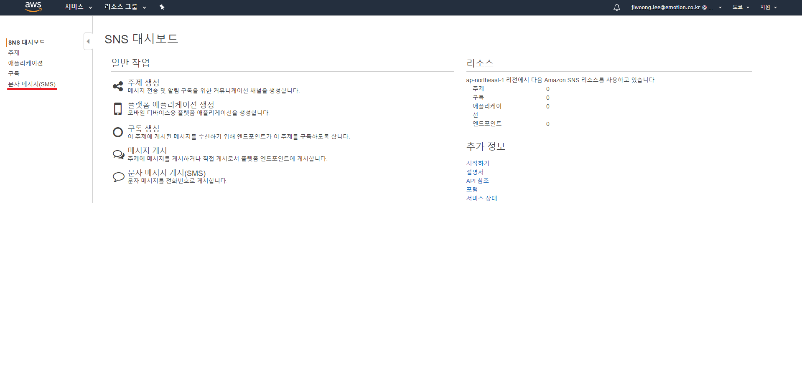
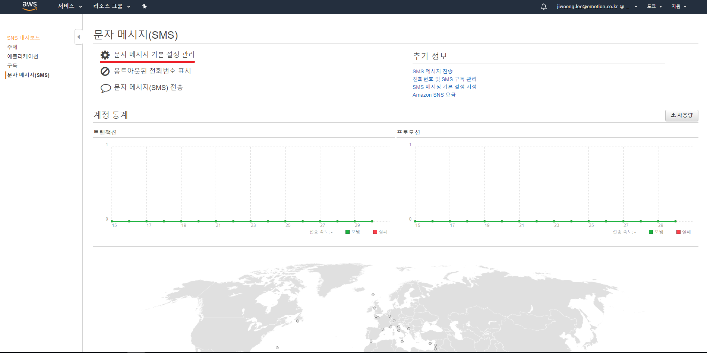
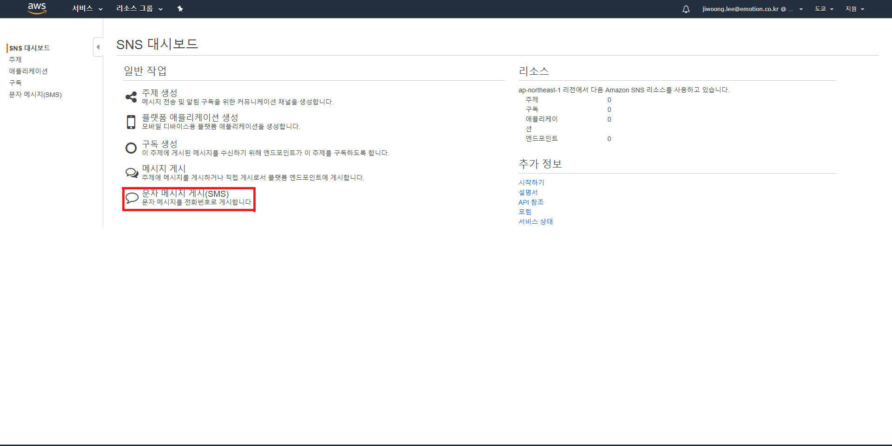
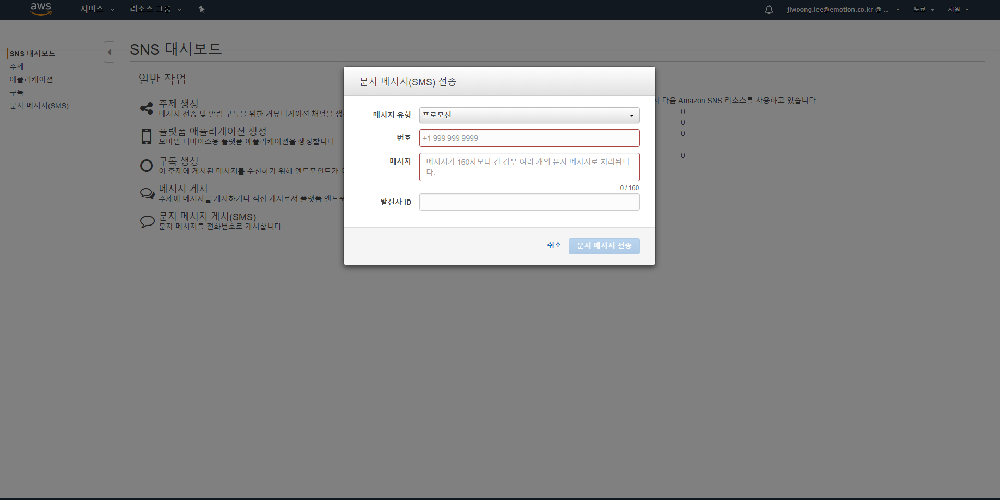
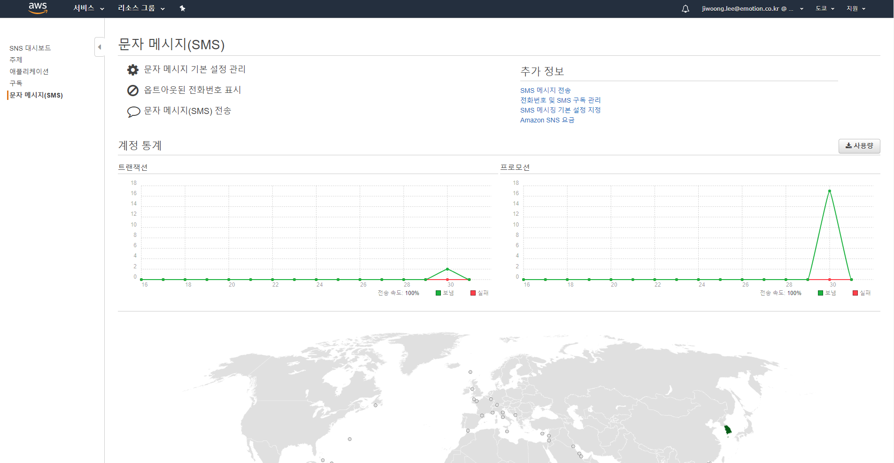

AWS - SNS 사용 예제
==============================================================================

### 1. SNS를 사용하기 위한 설정

1. AWS 회원가입, IAM 권한등록, 액세스 키 생성 (대부분의 aws 서비스의 공통사항으로 추후 문서화)
   - 자격 증명 등록
   		- 자격 증명에 대한 종류는 여러가지가 존재하나 해당 예제에서는 AWS에서 권장하는 방법으로 수행한다.
   		- 아래의 해당되는 위치에 ACCESS_KEY, SECRET_KEY를 입력

   		  Linux, macOS, or Unix : ~/.aws/credentials

          Windows : C:\Users\USERNAME \.aws\credentials

		  ※ 참조 : https://docs.aws.amazon.com/ko_kr/sdk-for-java/v1/developer-guide/setup-credentials.html

2. Simple Notification Service로 이동

3. 리전(지역) 선택 후, 시작하기 버튼 클릭
   - 목록에는 많은 리전들이 존재하지만 SMS 메시징을 지원하는 리전은 아래와 같다.(2018.01.29 기준)

     ※ https://docs.aws.amazon.com/ko_kr/sns/latest/dg/sms_supported-countries.html

   	- 미국 동부(버지니아 북부)
   	- 미국 서부(오레곤)
   	- EU(아일랜드)
   	- 아시아 태평양(도쿄)
   	- 아시아 태평양(싱가)

### 2. CONSOLE 사용방법

1. 레프트 바 메뉴에서 문자 메시지(SMS) 클릭

2. 메인 메뉴에서 문자 메시지 기본 설정 관리 클릭

3. 기본설정 업데이트 하기
   ※ CONSOLE 발송에 대한 설정으로 SDK발송설정과는 별개

   참조 : https://docs.aws.amazon.com/ko_kr/sns/latest/dg/sms_preferences.html

   

	- 기본메시지 유형
		- [Promotional] (기본값) – - 중요하지 않은 메시지입니다(예: 마케팅 메시지). Amazon SNS는 최소 비용이 발생하도록
		 	메시지 전송을 최적화합니다.
        - [Transactional] – - 고객 트랜잭션을 지원하는 중요한 메시지입니다(예: 멀티 팩터 인증을 위한 일회용 암호). Amazon SNS는 최고의 			안정성을 달성하도록 메시지 전송을 최적화합니다.
	- 계정 지출 한도 **(※중요※ 참조사이트 확인)**
		- 매월 SMS 메시지에 지출하려는 최대 금액(USD)을 입력합니다. Amazon SNS가 SMS 메시지를 전송하면 해당 월의 지출 한도를 초과하는 				비용이 발생할 것으로 확인하는 경우 Amazon SNS는 몇 분 이내에 SMS 메시지 게시를 중지합니다.
	- CloudWatch Logs 액세스를 위한 IAM 역할
		- Amazon SNS가 CloudWatch Logs에서 SMS 전송에 대한 로그를 작성할 수 있도록 허용하는 IAM 역할을 생성합니다.
	- 기본 샘플 성공률
		- Amazon SNS가 CloudWatch Logs에 로그를 작성할 SMS 전송 성공 비율을 지정합니다.
	- 기본 발신자 ID
		- 공백 없이 최소 1자의 문자를 포함하여 최대 11자의 영숫자로 이루어진 사용자 지정 ID를 입력합니다.
		  발신자 ID는 수신 디바이스에 메시지 발신자로 표시됩니다. 예를 들어, 기업 브랜드를 사용하여 메시지 소스를 더
          인식하기 쉽게 만들 수 있습니다.
		  발신자 ID에 대한 지원은 국가 또는 지역별로 다릅니다. 예를 들어, 미국 전화번호로 전달된 메시지에는 발신자 ID가
          표시되지 않습니다. 발신자 ID를 지원하는 국가 및 지역을 확인하려면 지원되는 [리전 및 국가 단원](https://docs.aws.amazon.com/ko_kr/sns/latest/dg/sms_supported-countries.html "리전 및 국가 단원")을 참조하십시오.
	- 보고서 스토리지
		- Amazon SNS에서 일일 SMS 사용 보고서를 수신할 Amazon S3 버킷의 이름을 입력합니다. 일일 사용 보고서를 수신할 Amazon S3 버킷을 		  지정하지 않으면 Amazon SNS는 일일 사용 보고서를 생성하지 않습니다.

4. 메인 메뉴에서 문자 메시지 게시(SMS) 클릭

5. 문자 메시지 발송
   번호 ex) 010-1111-2222 > 821011112222
   

6. 발송정보 통계화면에서 확인
   

## 3-1. SDK 사용방법

1. 기본설정
	- pom.xml dependency 추가

			<dependency>
                <groupId>com.amazonaws</groupId>
                <artifactId>aws-java-sdk-sns</artifactId>
                <version>1.11.271</version>
            </dependency>
	- AwsConfig.java (SMS 기본설정)
	  location : com.awsSns.config

      ※ 참조 : https://docs.aws.amazon.com/ko_kr/sns/latest/dg/sms_preferences.html

      참조사이트 샘플의 AmazonSNSClient class의 경우 현재 사용하지 않기에 소스 변경(2018.01.30 기준)

      	※ CONSOLE 설정과 내용 동일
      	- 기본메세지 유형 : DefaultSMSType
      	- 계정 지출 한도 : MonthlySpendLimit
      	- CloudWatch Logs 액세스를 위한 IAM 역할 : DeliveryStatusIAMRole
      	- 기본 샘플 성공률 : DeliveryStatusSuccessSamplingRate
      	- 기본 발신자 ID : DefaultSenderID
      	- 보고서 스토리지 : UsageReportS3Bucket

## 3-2 문자발송 - 기본설정
		1. 서버 시작
		2. http://localhost:8080/sendSms (가급적 postMan 사용)
		3. 문자발송 확인

## 3-3 문자발송 - 기본설정보다 우선순위로 적용되는 설정
		1.서버 시작
		2. http://localhost:8080/sendSmsSpecial
		3. 문자발송 확인

		※ 아래 적용된 설정의 경우 기본설정보다 우선적으로 적용된다.
        	- 기본메세지 유형 : AWS.SNS.SMS.SMSType
        	- 계정 지출 한도  : AWS.SNS.SMS.MaxPrice
        	- 기본 발신자 ID  : AWS.SNS.SMS.SenderID

## 3-4 구독을 통한 여러 전화번호로 SMSM 전송 (추후 업데이트...)